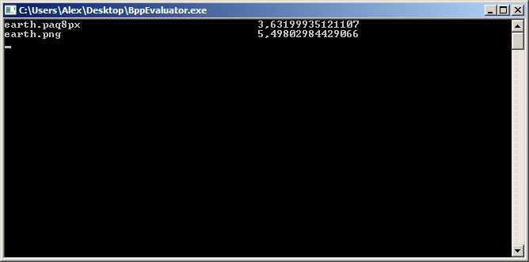

Bpp Evaluator
===================================
Version 1.0 Released by [Alexandru Dorobanțiu](http://alex.dorobantiu.ro) on 30.01.2018

### Features
 - a simple program to compute the Bits Per Pixel for compressed images passed as parameter args
 - the program looks in the same folder for an uncompressed image or a known file type in order to do the math
 - supports nested lookup (1 level) ex: available test.bmp, test.png, test.bmp.zip - the last file will also work and the computing will be done against test.bmp
 - bpp is displayed in a table like form for all the files sorted by filename
 - supports reading the size of the original files from the following formats: ".tif", ".tiff", ".bmp", ".png", ".jpg", ".jpeg", ".gif", ".ico", ".emf", ".exif", ".wmf", ".pgm", ".ppm", ".pbm"
 
### Technology:
 - Written in plain **C#** using **Visual Studio 2015**
 - **.NET** framework, version **3.5**
 
#### Details
The purpose of the project is to provide a simple way of computing the BitsPerPixel for compressed images.

##### Screenshots

[][CreativeCommonsLicence]
 
This work is licensed under a [Creative Commons Attribution-NonCommercial-ShareAlike 4.0 International License][CreativeCommonsLicence]

[CreativeCommonsLicence]: http://creativecommons.org/licenses/by-nc-sa/4.0/
 